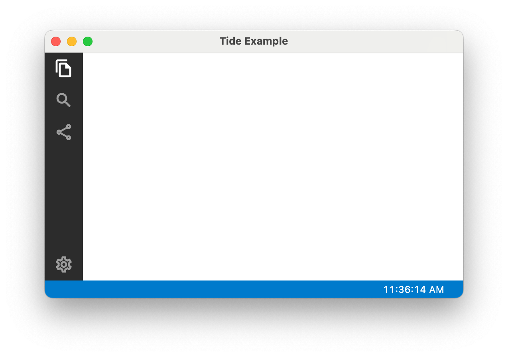
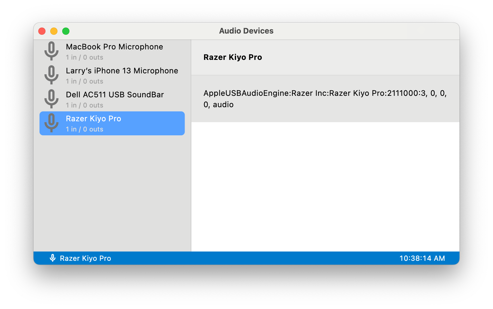
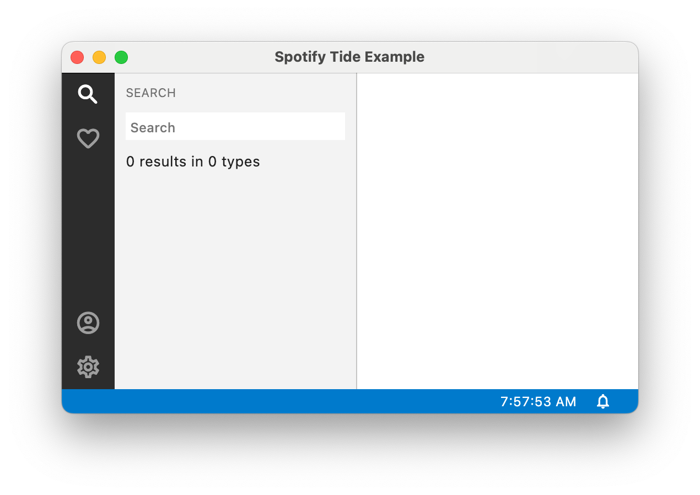
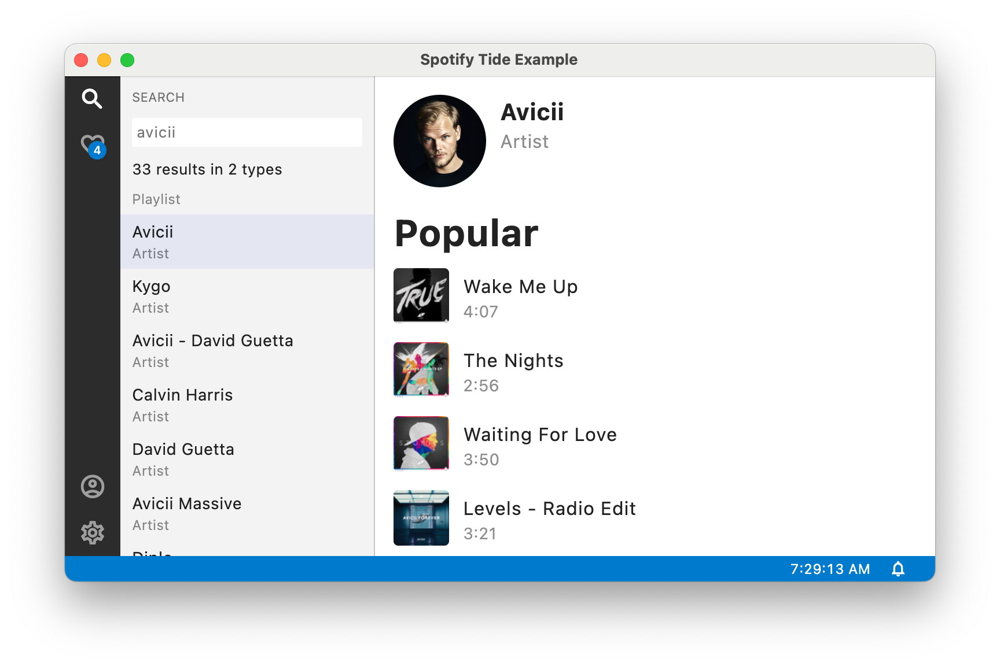
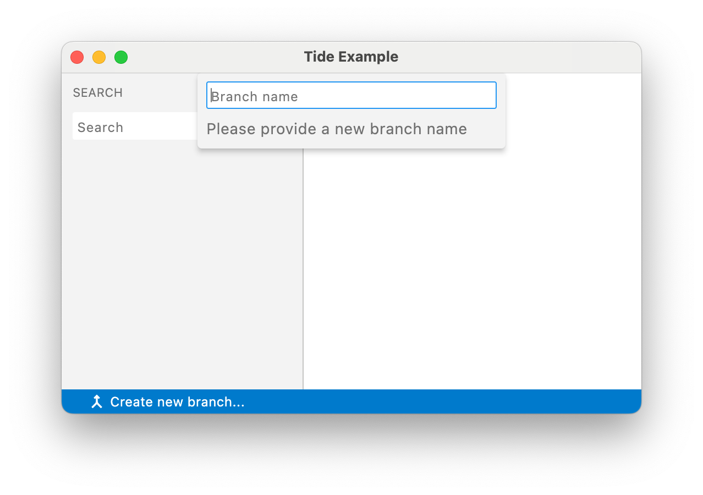
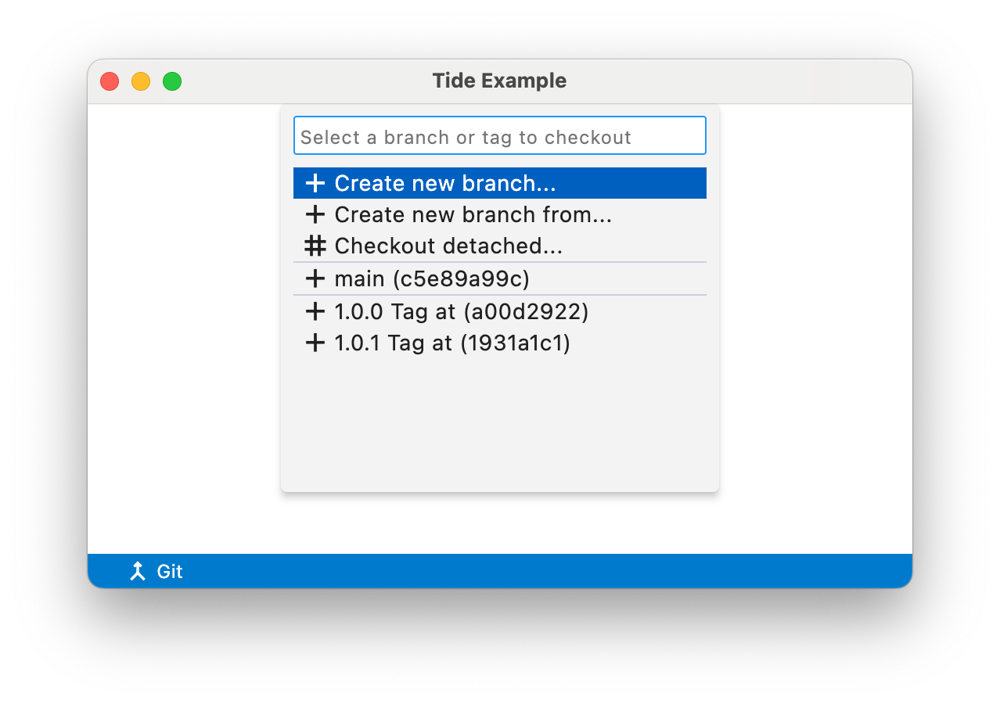

# Tide Kit

[](https://pub.dartlang.org/packages/tide_kit)
<a href="https://www.buymeacoffee.com/larryaasen">
  
</a>

Tide Kit is a toolkit for building IDE and studio like apps on all platforms using Flutter.


# Build tools faster

Using Tide Kit will make building cross platform IDE and studio desktop tools faster by utilizing a common set of pre-built widgets and services. It is ideal for desktop and web apps, but will also run on mobile.

The UI includes a window widget and a workbench widget that can be used in any Flutter application just like any other Widget.

A workbench can contain a status bar, activity bar, and panels that can be all be controlled by commands and hot keys.

# Key Concepts

This section defines key concepts of Tide Kit.

**Action**: An action is a command with a title, menu, keybinding, and can be exposed in the UI.

**Activity bar**: An activity bar is a vertical bar on the side of the workbench that contains various icon buttons.

**Command**: A command is a runnable function defined by an ID.

**Console**: A console is a panel that displays log messages.

**Contribution**: A contribution is a class that extends a component using commands, actions, and services. There are several types of contributions including command and workbench.

**Extension**: An extension is a class that registers various commands, actions, contributions, services, and widgets to build a cohesive feature.

**Key binding**: A combination of keyboard keys (key set) that trigger a command. This is the same as a keyboard shortcut.

**Logging**: Logging is used to log messages to be displayed in the console.

**Notification**: A notification is a rich interactive message that is briefly displayed over the workbench.

**Panel**: A panel is part of a workbench and displays the content.

**Quick Input**:  A way to gather user input, either by entering text or selecting an option from a list.

**Registry**: A registry is a collection of objects that can be retrieved by a class Type.

**Service**: A service is a class that provides functionality to the system that does not have a UI.

**Status bar**: A status bar is a short widget that is displayed at the bottom of a workbench and contains various items of minimal content.

**Tide ID**: An ID that is a unique identifier for an action, activity bar item, command, extension, panel, service, or status bar item.

**Widget**: A Flutter widget that is part of the Tide UI.

**Window**: A window is a top-level widget that contains a workbench.

**Workbench**: A workbench is the main widget that contains the activity bar, panels, and status bar. It is a child of the window.

# Getting started

### Example 1
When implementing a new app with Tide, start with this example to display a standard workbench with a
status bar, and Tide initialization.
```dart
void main() {
  final _ = Tide();
  runApp(
    TideApp(
      home: TideWindow(
        workbench: TideWorkbench(
          statusBar: const TideStatusBar(),
        ),
      ),
    ),
  );
}
```

When running this code on macOS you should see a window like this:


Note that the use of `TideApp` is optional and does not affect the functionality of the Tide app.
It is provided as a convenience to help you get started with your app.

For more detailed examples, look at the `example/lib/main.dart` file [here](https://github.com/larryaasen/tide/tree/main/packages/tide_kit/example/lib/main.dart).

When adding Tide to an existing app, just start with a `TideWindow`.

### Example 2
Here is an example with an activity bar and a status bar item for the current time.
When running this code on macOS you should see a window like this:
```dart
void main() {
  final tide = Tide();
  tide.useServices(services: [Tide.ids.service.time]);

  final workbenchService = Tide.get<TideWorkbenchService>();
  workbenchService.layoutService.addActivityBarItems([
    TideActivityBarItem(title: 'Explorer', icon: Icons.file_copy_outlined),
    TideActivityBarItem(title: 'Search', icon: Icons.search_outlined),
    TideActivityBarItem(title: 'Share', icon: Icons.share_outlined),
    TideActivityBarItem(
        title: 'Settings',
        icon: Icons.settings_outlined,
        position: TideActivityBarItemPosition.end),
  ]);

  runApp(
    TideApp(
      home: TideWindow(
        workbench: TideWorkbench(
          activityBar: const TideActivityBar(),
          statusBar: TideStatusBar(
            items: [
              TideStatusBarItemTime(position: TideStatusBarItemPosition.right)
            ],
          ),
        ),
      ),
    ),
  );
}
```


### Example 3
Here is a more extensive example with left and right panels, activity bar, and a few status bar items.
When running this code on macOS you should see a window like this:
```dart
void main() {
  final tide = Tide();

  tide.useServices(services: [
    Tide.ids.service.notifications,
    Tide.ids.service.time,
  ]);

  final leftPanelId = TideId.uniqueId();
  final mainPanelId = TideId.uniqueId();

  final workbenchService = Tide.get<TideWorkbenchService>();
  workbenchService.layoutService.addPanels([
    TidePanel(panelId: leftPanelId),
    TidePanel(panelId: mainPanelId),
  ]);
  workbenchService.layoutService.addActivityBarItems([
    TideActivityBarItem(
      title: 'Calendar Day',
      icon: Icons.calendar_month,
    ),
  ]);

  final tideOS = TideOS();

  final statusBarColor = ValueNotifier<Color?>(null);

  TideNotification? timeNotification;

  tide.workbenchService.layoutService.addStatusBarItem(TideStatusBarItem(
    position: TideStatusBarItemPosition.left,
    builder: (context, item) {
      return TideStatusBarItemContainer(
        item: item,
        onPressed: (TideStatusBarItem item) {
          statusBarColor.value =
              statusBarColor.value == null ? Colors.red : null;
        },
        tooltip: 'Click to toggle the status bar',
        child: const Row(
          children: [
            Icon(Icons.sync, size: 16.0, color: Colors.white),
            SizedBox(width: 4.0),
            Text('Toggle status bar', style: TideStatusBarItemTextWidget.style),
          ],
        ),
      );
    },
  ));

  num progressWorked = 0;
  final progressItem = TideStatusBarItemProgress(
    position: TideStatusBarItemPosition.center,
    infinite: false,
    progressTotal: 10.0,
    progressWorked: progressWorked,
    onPressedClose: (TideStatusBarItem item) {
      if (item is TideStatusBarItemProgress) {
        final newItem = item.copyWith(infinite: true);
        tide.workbenchService.layoutService.replaceStatusBarItem(newItem);
      }
    },
    tooltip: 'Click to restart the progress bar',
  );
  tide.workbenchService.layoutService.addStatusBarItem(progressItem);

  Timer.periodic(const Duration(milliseconds: 250), (timer) {
    final item = tide.workbenchService.layoutService.statusBarState.value
        .getItem(progressItem.itemId);
    if (item is TideStatusBarItemProgress) {
      if (!item.infinite) {
        progressWorked = progressWorked == 10 ? 0 : progressWorked + 1;
        final newItem = item.copyWith(progressWorked: progressWorked);
        tide.workbenchService.layoutService.replaceStatusBarItem(newItem);
      }
    }
  });

  tide.workbenchService.layoutService.addStatusBarItem(TideStatusBarItem(
    position: TideStatusBarItemPosition.right,
    builder: (context, item) {
      return TideStatusBarItemContainer(
        item: item,
        tooltip: 'Account',
        child:
            const Icon(Icons.account_circle, size: 16.0, color: Colors.white),
      );
    },
  ));

  tide.workbenchService.layoutService.addStatusBarItem(TideStatusBarItemText(
    position: TideStatusBarItemPosition.right,
    onPressed: (TideStatusBarItem item) {
      final notificationService = Tide.get<TideNotificationService>();
      final notification = TideNotification(
          message: 'Flutter: Hot reloading...',
          severity: TideNotificationSeverity.info,
          autoTimeout: true,
          progressInfinite: true);
      notificationService.notify(notification);
      final msg2 =
          '${tideOS.currentTypeFormatted} ${tideOS.operatingSystemVersion}';
      notificationService.warning(msg2, autoTimeout: true);
      final msg1 =
          '${tideOS.currentTypeFormatted} ${tideOS.operatingSystemVersion}'
          ' This is a very long message to test out lots of wrapping across this notification.';
      notificationService.error(msg1, autoTimeout: true);
      final msg =
          '${tideOS.currentTypeFormatted} ${tideOS.operatingSystemVersion}';
      notificationService.info(msg, autoTimeout: true, allowClose: false);
    },
    text: tideOS.currentTypeFormatted,
    tooltip: 'OS Type',
  ));

  tide.workbenchService.layoutService.addStatusBarItem(TideStatusBarItemTime(
    position: TideStatusBarItemPosition.right,
    tooltip: 'The current time',
    onPressed: (TideStatusBarItem item) {
      final notificationService = Tide.get<TideNotificationService>();
      if (timeNotification == null ||
          !notificationService.notificationExists(timeNotification!.id)) {
        final timeService = Tide.get<TideTimeService>();
        final msg =
            'The time is: ${timeService.currentTimeState.timeFormatted()}';
        timeNotification =
            notificationService.info(msg, autoTimeout: true, allowClose: false);
      }
    },
  ));

  tide.workbenchService.layoutService.addStatusBarItem(TideStatusBarItem(
    position: TideStatusBarItemPosition.right,
    builder: (context, item) {
      return TideStatusBarItemContainer(
        item: item,
        tooltip: 'Notifications',
        child: const Icon(Icons.notifications_none_outlined,
            size: 16.0, color: Colors.white),
      );
    },
  ));

  runApp(
    ValueListenableBuilder<Color?>(
      valueListenable: statusBarColor,
      builder: (context, colorValue, child) {
        return TideApp(
          home: TideWindow(
            workbench: TideWorkbench(
                activityBar: const TideActivityBar(),
                panelBuilder: (context, panel) {
                  if (panel.panelId.id == leftPanelId.id) {
                    return TidePanelWidget(
                      panelId: panel.panelId,
                      backgroundColor: const Color(0xFFF3F3F3),
                      position: TidePosition.left,
                      resizeSide: TidePosition.right,
                      minWidth: 100,
                      maxWidth: 450,
                      initialWidth: 220,
                      child: const Center(child: Text('Left Panel')),
                    );
                  } else if (panel.panelId.id == mainPanelId.id) {
                    return const TidePanelWidget(
                      backgroundColor: Colors.white,
                      expanded: true,
                      position: TidePosition.center,
                      child: Center(child: Text('Main Panel')),
                    );
                  }
                  return null;
                },
                statusBar: TideStatusBar(backgroundColor: colorValue)),
          ),
        );
      },
    ),
  );
}
```


### Example 4

### Search Example
For the code for example 5, look at [example2/lib/main.dart](https://github.com/larryaasen/tide/tree/main/packages/tide_kit/example2/lib/main.dart) and [example2/lib/spotify_tide_extension.dart](https://github.com/larryaasen/tide/tree/main/packages/tide_kit/example2/lib/spotify_tide_extension.dart)


### Spotify Example


### Quick Input

Use `TideQuickInputBox` as a way to gather user input fron a `TextField`. It is a generic prompt
to allow a user to enter text.

```dart
  ...
  onPressed: (BuildContext context, item) {
    final inputBox = TideQuickInputBox(
      placeholder: 'Branch name',
      prompt: 'Please provide a new branch name',
      onDidAccept: (String value) {
        final notificationService =
            Tide.get<TideNotificationService>();
        notificationService.info('Created branch name: $value');
      },
    );

    TideQuickInputBoxWidget.show(context, inputBox);
  }),
```

Use `TideQuickPick` as a way to gather user input from a list of items. The user can filter the list by entering text into the text field. The list supports up and down arrow movement to highlight specific rows, and the highlighted item can be selectced by clicking or the hitting the Enter/Return key.

```dart
  ...
  onPressed: (BuildContext context, item) {
    final quickPick = TideQuickPick(
      placeholder: 'Select a branch or tag to checkout',
      items: [
        TideQuickPickItem(
            label: 'Create new branch...',
            leadingIcon: Icons.add),
        TideQuickPickItem(
          label: 'Create new branch from...',
          leadingIcon: Icons.add,
        ),
        TideQuickPickItem(
            label: 'Checkout detached...',
            leadingIcon: Icons.tag,
            showSeparator: true),
        TideQuickPickItem(
          label: 'main (c5e89a99c)',
          leadingIcon: Icons.add,
          showSeparator: true,
        ),
        TideQuickPickItem(
          label: '1.0.0 Tag at (a00d2922)',
          leadingIcon: Icons.add,
        ),
        TideQuickPickItem(
          label: '1.0.1 Tag at (1931a1c1)',
          leadingIcon: Icons.add,
        ),
      ],
      onDidAccept: (TideQuickPickItem item) {
        final notificationService =
            Tide.get<TideNotificationService>();
        notificationService.info('Selected: ${item.label}');
      },
    );

    TideQuickPickWidget.show(context, quickPick);
  }),
```

<!--
# Widgets

## TideApp

## TideWindow

## TideWorkbench

## TideActivityBar

## TideStatusBar

Will display a collection of items (TideStatusBarItem) on a small status bar at the bottom of a workbench (TideWorkbench).

## TidePanel

Available positions: left, right, top, bottom

## TideConsole

## Commands

- tide.command.toggleStatusBarVisibility

## TideCommandContribution

A command contribution is a collection of commands that are registered with the command registry. This is not necessary for all commands, but is useful for organizing the handler for a command.

### TideTogglePanelVisibilityContribution

Contributes a command that toggles the visibility of a panel.

### TideToggleStatusBarVisibilityContribution

Contributes a command that toggles the visibility of the status bar.

## Workbench

## Panels

## Status bar

## Activity bar

## Key bindings (Hot keys) (keyboard shortcuts)


# Services

## TideKeybindingService

## TideLoggingService

## TideNotificationService

## TideTimeService

## TideWorkbenchLayoutService

## TideWorkbenchService

-->

# Contributing
All [comments](https://github.com/larryaasen/tide/issues) and [pull requests](https://github.com/larryaasen/tide/pulls) are welcome.

# Donations / Sponsor

Please sponsor or donate to the creator of `tide_kit` on [Patreon](https://www.patreon.com/larryaasen).

# Builds

[](https://github.com/larryaasen/tide/actions/workflows/test.yml)
